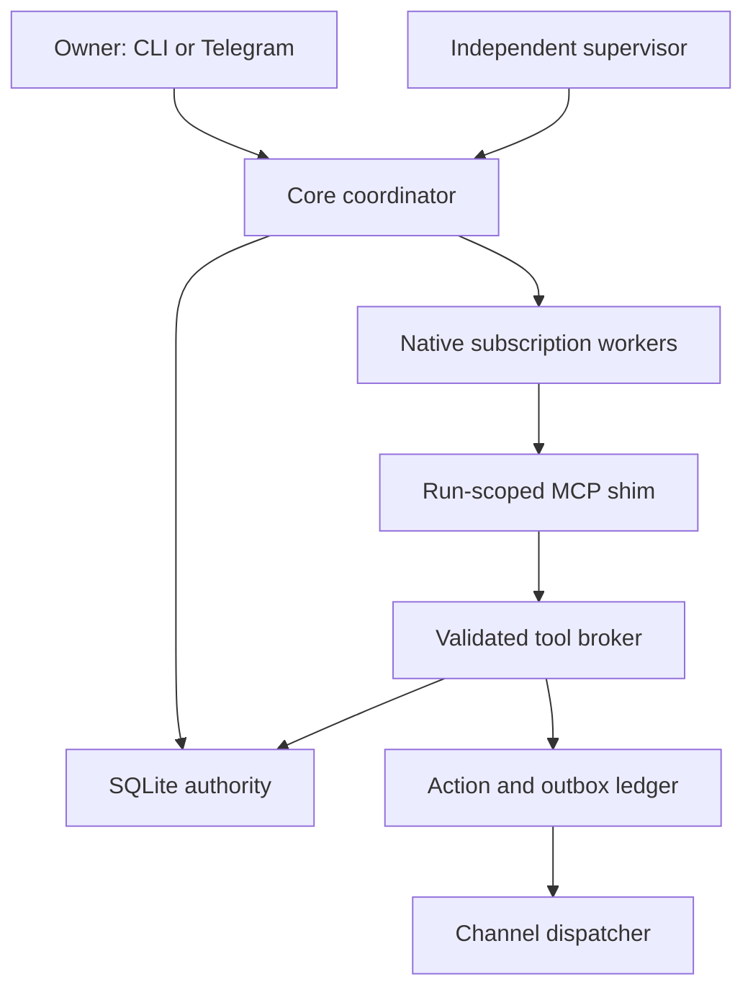

# Architecture and decisions

Source contract: the owner-provided ADR-0001, 7 September 2026. The owner explicitly named the assistant **Theo**; the distribution is `theo-assistant`, the import package and CLI are `theo`.

## Source organization

Packages follow the responsibility that owns a behavior. Shared contracts and the database authority remain at the root; orchestration composes the feature services. Import concrete modules directly rather than adding broad re-exports to package initializers.

| Location under `src/theo/` | Responsibility |
| --- | --- |
| `domain.py`, `config.py` | Shared data contracts, errors, identities and operator configuration. |
| `storage.py`, `migrations/`, `privacy.py` | SQLite transactions and migrations, shared persistence primitives and conversation visibility. |
| `application/` | `service` owns daemon lifetime and background loops; `coordinator` runs leased attempts; `commands` handles host commands; `status` provides a read-only projection. |
| `work/` | Job admission and fencing, schedules, goal plans, background-work policy and reviewed improvements. |
| `memory/` | `store` owns canonical revisions and retrieval; `context` assembles auditable worker input; `embeddings` maintains the optional derived index. |
| `tools/` | `schemas` defines wire inputs; `registry` binds handlers and receipt policy; `authorization` checks leases and visibility; `broker` owns grants, validation, receipts, audit and the socket. |
| `tools/handlers/` | Model-facing memory, work, workspace, feedback and outbound operations, each calling the appropriate service. |
| `backends/` | Separate Claude, Codex and ACP adapters, a shared native lifecycle, account policy, RPC transport and adapter factory. |
| `delivery/` | Transactional actions and outbox receipts in `ledger`, transport contracts in `contracts`, pure text splitting in `chunking`. |
| `channels/telegram/` | Polling/admission adapter, API sender, media hydration, persistent state, pure normalization, controls, rendering and diagnostics. |
| `channels/terminal/` | Durable client, attachment ingestion, turn presentation and interactive prompt loop. |
| `content/` | Artifact validation/storage, guarded public-web reads and optional local media processing. |
| `execution/` | OS isolation, owned-process recovery, workspace execution/promotion and file checksums. |
| `operations/` | Verified backups, portable export, legacy import, release management and qualification evidence. |
| `observability/` | Bounded instrumentation and the independent read-only host observer. |
| `cli/`, `__main__.py`, `mcp_shim.py`, `supervisor.py`, `observer.py` | Operator CLI and process entry points. The root observer module preserves existing service launch commands. |

### Dependency rules

- Shared contracts, persistence and feature services do not import their callers in the application, CLI, channels or tool broker. Conversation commands receive a cancellation callback from the coordinator rather than importing it.
- Channel adapters translate input and remote receipts. Durable jobs belong to `work`; memory policy belongs to `memory`; outbound approvals and uncertainty belong to `delivery`.
- A tool handler receives an immutable `ToolCall` containing the authorized database view, settings, run context and conversation scope. It cannot grant capabilities or change the catalog. Bulk memory calls repeat the per-item authorization checks.
- Tool definitions declare `read`, `write` or `outbound` effects explicitly. The broker reserves replay receipts for writes, while outbound operations use the delivery ledger. Registry order has no effect on this policy. Browsing with optional screenshot storage retains a write receipt even though its successful response status is `ok`.
- Native adapters own only their protocol and execution lifecycle. The application selects and coordinates them through `backends.factory`; shared process recovery does not import the supervisor.
- Package initializers stay lightweight. Optional dependencies load at the point of use. Deferred imports must not conceal a module cycle.

`tests/test_architecture.py` checks import resolution, cycles, dependency direction, CLI import isolation and the published tool schemas. Existing behavior tests remain under `tests/`; operational probes and evaluation entry points keep their documented names under `scripts/`.

### Adding or changing code

Put business rules in the owning service and keep tool/channel adapters thin. To add a tool, define a strict input model in `tools/schemas.py`, implement the appropriate capability handler, and register its schema, description and effect policy in `tools/registry.py`. Regenerate the reference with `uv run python scripts/export_tool_schemas.py` and test its real state/receipt behavior.

Every production module starts with a docstring explaining what it owns and how it relates to neighboring modules. Describe the actual responsibility and important boundaries rather than repeating the filename or making general quality claims. Ruff requires module and package docstrings.

The reorganization changes internal Python import paths. The `theo` console command, `python -m theo`, MCP shim, supervisor and observer launch paths remain available. SQL migration files, checksums, persisted formats and model-visible tool contracts are unchanged; no data migration is required.

## Boundaries

The core owns the writable database and channel credentials. Models cannot select an owner, run, generation, database or grant list. Host-created capabilities bind those fields. Every broker mutation rechecks the current lease inside its SQLite transaction. Native filesystem/terminal approval callbacks cannot grant extra authority. The local MCP shim contains no database path or Telegram credential.

`storage.py` uses one writer executor, WAL, `synchronous=FULL`, foreign keys, bounded busy waiting and short transactions. Network operations never occur inside a database transaction. Migrations have checksums. A stale writer receives a conflict; a failed statement rolls back without wedging the executor.

## State and continuity

Complete current and historical memory bodies, source/provenance, corrections, facts, persona, skills, goals, commitments, messages and checkpoints live in SQLite. Markdown and prompt files are disposable projections. Bodies are not filesystem pointers. Large binary originals use immutable content hashes; extracted text and artifact metadata remain in the database. Backups copy the exact referenced blob set.

Retrieval combines lexical and optional local semantic candidates by reciprocal rank fusion, then bounded graph expansion and pinned records. The assembler rechecks archive status and revision at snapshot commit, accounts for mandatory state/current input/output reserve, and records actual selected sources and exclusions. Archived or revised embeddings cannot return as current evidence. Embedding repair is durable and uses a warm model instance when assets are present.

All four adapters start fresh native sessions with canonical context. This deliberately avoids reusing an opaque provider conversation after a different backend changed state. Tool evidence and unfinished jobs enter checkpoints; the complete transcript remains queryable. Checkpoints are bounded extracts, not lossless summaries of arbitrarily long transcripts. A mandatory context overflow stops with an explicit compaction requirement instead of silently dropping authoritative state.

## Execution and effects

Interactive and background reasoning use the same native eligibility gate. Effective configuration, runtime version and account/model catalogue must match current evidence. Unknown usage is `null`, not zero. Shared quota pools remain shared. Auth/quota failures preserve jobs for explicit operator retry after eligibility is restored; no inference retry loop or metered fallback exists.

Jobs have durable identities, root/parent relationships, deadlines, available times and fencing generations. One conversation runs at a time. Two worker slots default to one background slot, reserving interactive capacity. Due requested reminders are converted directly into final delivery obligations without claiming a model slot. Cancellation revokes grants and stops owned native process groups. A process birth-time registry protects recovery from recycled PIDs.

Effects pass through request-hashed actions, expiring approvals and multipart outbox chunks. Successful chunks retain receipts and are not replayed. A timeout after possible remote acceptance becomes `uncertain`; the owner must reconcile it. There is no exactly-once network claim. Mutating broker calls reserve semantic receipts before execution. An interrupted call without a committed result is conservatively uncertain, avoiding duplicate side effects at the cost of manual review.

## Behaviour and improvement

Persona is seeded into SQLite and the final context instruction keeps Theo warm, candid and concise. Repeated questions explicitly trigger reassessment. Model inference never becomes an authoritative owner correction without review. Goal completion requires executable steps and evidence; weak engagement is not treated as strong preference evidence.

Autonomy uses typed work, proposal or justified no-op results with cadence and source-hash deduplication. It does not run a continuous inference loop. Optional outreach requires a hash-bound critic pass, quiet-hour and attention checks. Requested obligations are treated separately. Skills require narrow triggers and recorded tests before activation; activation never expands grants. Reflection/reflexion generate attributable proposals. Isolated code worktrees, bounded command execution and serialized fast-forward promotion are implemented building blocks; unattended self-patch deployment is not qualified or enabled.

## Deliberate departures and limits

- Telegram uses a bounded, escaped rich renderer with literal-text fallback after definite rejection, Unicode-safe chunks, and caption continuations. Private drafts are ephemeral; final delivery remains ledger-controlled. See [Telegram](telegram.md).
- The local video path supplies up to eight timestamped samples and retains the original. Coverage remains partial. Audio transcription requires locally provisioned Apple Silicon speech assets.
- Native workers use their native login stores. Generated code has a stricter Mac profile denying native-home credentials, networking and protected core paths. Linux dedicated-UID isolation is a canary path, not a qualified generated-code sandbox. Local macOS sandbox canaries cover protected/sibling paths, generated-code credential denial and installed Codex startup. Complete target deployment verification remains separate and may require adjustment for the installed vendor runtime.
- Conservative retries, explicit account re-verification and operator code promotion favor reviewable state. Automatic cross-provider selection, general long-history semantic compaction and unattended self-patch promotion remain follow-up implementation work, separately identified in the requirement matrix.
- Qualification reports are operator-only, source-attributed records. They are evidence attestations, not cryptographic proof of human grades or observed uptime. Configuration booleans alone cannot qualify a deployment.

## Reference archaeology

Reference repository: `fpl0/luke`, pinned at `2625c272d107db9f2275224d05fbb4adde736b6f`. Reviewed areas included correction history, context assembly, planner/state reconciliation, scheduler delegation reports, work claims and schema ownership. No reference application module or test was copied.

History informed specific safeguards: explicit run IDs across asynchronous quality attribution (`90ff309`), tool-only evidence across model handoffs (`fd14c94`), interrupted rather than failed deliberate shutdown (`17e03d3`), and runtime/model changes requiring recorded canary evidence (`2625c27`). These are design lessons, not assertions that this implementation reproduces every Luke behaviour.

Protocol sources inspected: [Claude CLI](https://code.claude.com/docs/en/cli-reference), [Claude authentication](https://code.claude.com/docs/en/authentication), [Codex App Server](https://learn.chatgpt.com/docs/app-server), [Cursor ACP](https://cursor.com/docs/cli/acp), [Grok headless CLI](https://docs.x.ai/build/cli/headless-scripting), [official ACP Python SDK](https://agentclientprotocol.github.io/python-sdk/), [Telegram Bot API](https://core.telegram.org/bots/api). Asset telemetry opt-out follows [Hugging Face's documented controls](https://huggingface.co/docs/huggingface_hub/en/package_reference/environment_variables).
