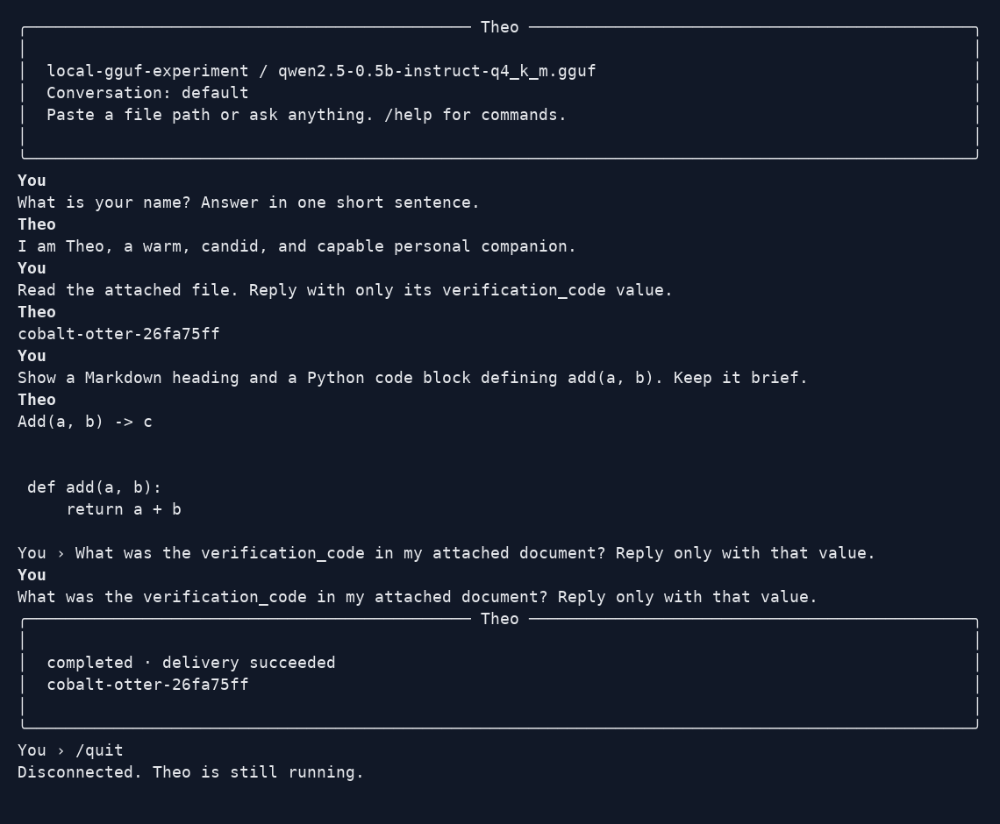

# Captured evidence

These reports preserve observations from specific dates, hosts and source snapshots. They are not a live installation status page. Start with [acceptance status](../acceptance.md) for the current summary and [live testing](../live-testing.md) for reproduction commands. Raw failures and partial runs remain alongside successful results.

| Evidence | Scope and reading guide |
| --- | --- |
| [Native Codex](native-e2e-codex.json), [native Claude](native-e2e-claude.json) | Four local production-adapter cases each on 8 September. [Code review](../review-2026-09-08.md) explains the harness and fixes. |
| [Complex Codex](complex-codex.json), [complex Claude](complex-claude.json) | Raw native transcripts and state assertions. Read with the [evaluation report](../complex-evaluation-2026-09-09.md). |
| [Codex review](complex-codex-review.json), [Claude review](complex-claude-review.json), [Codex scored](complex-codex-scored.json), [Claude scored](complex-claude-scored.json) | Separate subjective reviews and scored results bound to the raw reports. |
| [Reviewed source manifest](complex-reviewed-build.json) | Frozen build used by the complex evaluation; excludes concurrent Telegram changes. Old source paths and migration counts describe that snapshot. |
| [Telegram initial](telegram-client-2026-09-09.json), [extended](telegram-client-2026-09-09-extended.json), [outbound and Stop](telegram-client-2026-09-09-outbound.json) | Real private-chat client and transport checks, including synthetic drafts. [Implementation status](../telegram-implementation.md) lists pending coverage. |
| [Telegram recovery](telegram-client-2026-09-09-recovery.json), [prerequisites](telegram-client-2026-09-09-prerequisites.json) | Lost-acknowledgement reconciliation and a dated setup snapshot. No model-backed Telegram qualification. |
| [Local observability](observability-local-2026-09-09.json), [dashboard review](dashboard-design-2026-09-09.md) | Ten-minute memory/load qualification, correlation, alerts and dashboard checks. [Runbook](../observability.md). |
| [Native MCP: Claude](mcp-shim-claude.json), [Codex](mcp-shim-codex.json) | Real tool-channel probes; detailed scope below. |
| [Terminal results](results.json), [terminal capture](terminal-proof.png) | Experimental local Qwen inference, including an instruction-following failure; detailed scope below. |

The `complex-*-initial.json`, `complex-*-first-full.json`, `complex-*-pre-final-review.json` and intermediate reports retain failed attempts. `complex-codex-interrupted-mixed-snapshot.json` is an interrupted run, not a completed evaluation. `native-e2e-codex-initial.json` records the initial tool-denial failure. The earlier [compatibility](../compatibility.json), [capacity](../capacity-results.json) and [release](../release-verification.json) reports also retain their original scope.

## Experimental terminal inference — 7 September 2026

Recorded 2026-09-07 against source commit bf2eb498fc16a2c2eb58f665bc1deebb84eb9d17.



The PNG is a terminal emulation rendering of the unedited `resume-full.ansi` PTY recording, not a generated mockup. `terminal-proof.txt` is the corresponding screen text. `results.json` contains actual SQLite run outputs, requests, stream event counts and delivery receipts.

Passed: assistant identity; reading a unique verification code from an attached text file; rendering a Python fenced code block; reopening the actual CLI and recalling that code from persistent conversation context. The model omitted a requested Markdown heading: that instruction-following check failed. All four runs completed and delivered successfully. This is a small smoke test, not broad model qualification.

Model: Qwen2.5-0.5B-Instruct Q4_K_M, CPU inference using llama-cpp-python 0.3.35. Model revision and file SHA-256 are recorded in the JSON. No paid API or mocked model responses were used.

Scope: a separate real `theo chat` process sends requests through SQLite to the real Coordinator, Jobs and Delivery using `scripts/local_terminal_worker.py`. The experimental worker grants no tools and loads the GGUF directly. The original test host could not run the normal service supervisor and broker Unix socket (socket creation returned EPERM). Later macOS tests use real sockets; that does not change this experiment's scope. Telegram, native Codex, tools and image understanding were not tested by this experiment.

The initial interactive PTY's script recording stopped capturing mid-turn even though the application continued. Its partial raw file is retained as `initial-partial.ansi`; it is not proof of completed turns. The complete reconnect recording shows the persisted history and a fresh successful generation. The first terminal also reported unsupported cursor-position requests. The proof preserves these limitations.

### Reproduce

Install Theo from this checkout and install the optional experiment dependency `llama-cpp-python==0.3.35` in the same environment. Download `qwen2.5-0.5b-instruct-q4_k_m.gguf` from `Qwen/Qwen2.5-0.5B-Instruct-GGUF`, revision `9217f5db79a29953eb74d5343926648285ec7e67`.

Run in one terminal, using a fresh synthetic state directory:

```sh
python scripts/local_terminal_worker.py --root /tmp/theo-local-proof --model /absolute/path/to/qwen2.5-0.5b-instruct-q4_k_m.gguf
```

In another terminal:

```sh
python -m theo --data-root /tmp/theo-local-proof chat
```

Ask Theo's name. Create a text file containing a random `verification_code`, attach it with `/attach /absolute/path/to/file.txt`, and ask for the code without including it in the question. Ask for a Python code block. Exit with `/quit`, reopen the same CLI, and ask for the earlier code without reattaching. Stop the worker with Ctrl+C when finished. Use only synthetic files in this experiment.

For an ANSI capture, use `script -q -f capture.ansi` in a terminal set to 100 columns by 36 rows, run the CLI, then exit both CLI and recording shell. With `pyte==0.8.2`, Pillow and DejaVu Sans Mono installed, render using:

```sh
python scripts/capture_terminal.py capture.ansi capture.png
```

## Native MCP shim evidence — 7 September 2026

`mcp-shim-claude.json` and `mcp-shim-codex.json` are a different artifact from the terminal capture above, recorded 2026-09-07 while migrating `theo.mcp_shim` to the `mcp` 2.x server API. Each is one run of `scripts/mcp_shim_probe.py`: a real Claude Code or Codex process spawned the shim, discovered the granted tools over MCP and invoked them, and the run's unique marker was committed to SQLite. Both report `mcp` 2.1.1 and a zero exit.

Unlike the host that produced the terminal evidence, this host permits Unix server sockets, so the broker socket the shim depends on was exercised for real. The run grant covered `remember`/`recall` only. This is evidence for the tool channel alone: it is not Telegram evidence, not an isolation gate, and not a production qualification. See [live-testing.md](../live-testing.md#native-mcp-shim-probe) to reproduce.
