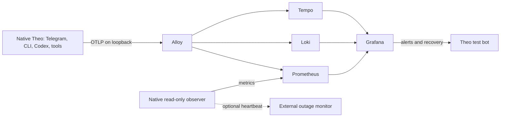

# Theo observability

This runbook covers the local macOS setup: Theo and its native Codex runtime stay on the host. Grafana, Alloy, Prometheus, Loki and Tempo run in a dedicated Docker Compose project. This feature does not install login services, deploy Theo, enable self-updates or configure data backups.

The local 2026-09-09 qualification passed with **1,818,072,848 bytes peak physical footprint** over ten minutes and 8,680 synthetic operations, including a 10× burst. There were no OOM events, container restarts, swap use or concurrent query failures. [Recorded evidence](evidence/observability-local-2026-09-09.json) distinguishes live test-bot traffic from protocol fixtures and load traffic. This is a bounded local qualification, not a claim about arbitrary ingestion volumes or long-term retention compaction.



## Run locally

Requirements: the locked Python environment, Docker CLI and Colima. Use a dedicated Colima profile so stack measurements and lifecycle commands are separate from other Docker workloads:

```sh
colima start theo-observability --activate=false --cpu 2 --memory 1.5 --disk 20 --vm-type vz
uv run --no-sync python scripts/observability.py up --with-test-core
uv run --no-sync python scripts/observability.py status
uv run --no-sync python scripts/observability.py check
```

Open [Theo Overview](http://127.0.0.1:13000/d/theo-overview). Anonymous Viewer access is bound to loopback; Explore and temporary query edits are enabled, while saving configuration requires authentication. Administrative username is `admin`; the generated password is in `observability/.env` (mode 0600, ignored by Git). Keep that file private. `THEO_DOCKER_CONTEXT` overrides the dedicated context if necessary; do not confuse a shared runtime's container totals with whole-stack memory proof.

`up --with-test-core` creates an isolated native core in `.local/observability/theo`. To observe an existing test instance, omit `--with-test-core` and pass `--data-root /absolute/path`. Only one observer binds port 19464. `down` stops only recorded local processes and this Compose project, preserving Docker volumes. It does not stop another task's Telegram poller or the Colima VM.

For an existing test daemon, select its root explicitly:

```sh
uv run --no-sync python scripts/observability.py up --data-root '/absolute/test/root'
```

The recorded 9 September test used the paired `Theo-Telegram-Test` root and its single existing poller. That is a historical setup, not a promise that the daemon is running now. Use the same selected root for alert marker commands. Native Theo and Codex memory is shown separately from the observability budget.

Enable telemetry before starting any native Theo entry point, including the Telegram setup helper, through environment variables:

```sh
THEO_TELEMETRY_ENABLED=1 THEO_TRACE_SAMPLE_RATIO=0.1 uv run --no-sync theo --data-root /absolute/root serve
```

Alternatively, create `DATA_ROOT/telemetry.json`:

```json
{"enabled": true, "sample_ratio": 0.1, "environment": "local", "endpoint": "http://127.0.0.1:14318"}
```

For qualification only, set the sample ratio to `1`. Environment variables override the file. `THEO_ENVIRONMENT=qualification` marks synthetic traffic; every dashboard has an environment selector so fixture activity does not masquerade as real conversations.

## What is collected

- Structured operational events with channel, operation, outcome, opaque job/run IDs, trace and span IDs. Message text, prompts, tokens, credentials and tool arguments are excluded. Exceptions record their class, not arbitrary exception text.
- OpenTelemetry spans across ingress, queued jobs, Codex runs, broker tool calls and delivery. A small `telemetry_links` SQL table preserves W3C trace context through writer threads, duplicate admission and restarts without changing business payload identity. Telegram saves the original context atomically with each received update, so normalization retries retain it. Albums use the first item's context as their parent and link to the remaining items.
- Operation latency histograms, queue latency, job/tool/delivery outcomes, first Codex output, and CLI user-perceived first response/turn completion timings.
- Media kind/extraction outcomes, native Codex connection timing, runtime attestation, model outcomes, schedules and goals, SDK queue capacity/occupancy/drops, collector failures and container restarts.
- Read-only native SQLite/host observation: core heartbeat, jobs, controls, pending approvals, Telegram ingestion, outbox states, uncertain effects, host resources and isolated container resources.
- Codex token usage and allowance windows only when the native App Server reports them. A missing value is not zero allowance. No subscription dollar cost is inferred.

CLI chat uses durable SQLite admission and polling. Its core-availability checks are distinct from the Unix socket used by native tool workers.

CLI latency charts use individual structured log observations so a session that exports only one metric sample is still represented. Long-running daemon charts use Prometheus rates and exemplars. Logs and traces for the CLI retain the same correlation IDs. Telegram admission-to-delivery timing measures each acknowledged outbound delivery from the originating job's admission; it does not measure when the owner read a message.

## Correlation and investigation

1. Open a latency graph and select an exemplar to jump to Tempo.
2. Use the trace's **Logs** link to see matching Loki events around its spans.
3. Expand a Loki event and use **Open trace**. Only sampled traces receive this link; all logs still carry trace context when available.
4. Use the trace's metric links to return to operation latency around the incident.

The ordinary trace sampling rate is 10%, parent based. Error logs are retained even when a trace was not sampled. Qualification runs use 100% sampling. There is no tail-sampling buffer or trace-derived metrics generator.

Tempo's log link uses a custom `trace_id` structured-metadata filter across Theo services in the same environment. A text-search-only link would miss these OpenTelemetry log records. The Loki link uses `sampled_trace_id`, keeping unsampled logs from advertising a nonexistent stored trace.

`check` creates an actual native OpenTelemetry canary, verifies the trace in Tempo, matching logs in Loki and the same trace ID in a Prometheus exemplar. It also queries every dashboard expression and writes `.local/observability/validation.json`. This is stronger than simply checking container startup.

The live test-bot album trace `d24cac14ae1acd9c527890a919d22055` contains 12 spans from polling and receipt through album admission, media hydration, the Codex attempt and reply delivery, with 27 correlated logs and matching metric exemplars. Its Codex outcome is `waiting_for_auth`. An offline regression separately proves successful receipt → retry → database reopen → AI → independent tool connection → delivery correlation without using a model account.

## Dashboards and alerts

The overview links to Jobs & Tools, Telegram, CLI, Codex and Infrastructure. Dashboards and Grafana alert rules are generated by `scripts/build_observability.py` and provisioned from `observability/grafana`. Changes in Grafana's UI are deliberately not the source of truth.

Start with **Attention now** on the overview, then follow blocked work into Codex diagnostics or open an event's trace. All six dashboards use compact status cards, consistent outcome colors, descriptive legends and a “Reading the signals” guide. The default window is 24 hours. Navigation preserves both the time window and the **Traffic** selection: **Live Theo** is real activity; **Test fixtures** is isolated validation. Missing measurements remain **No samples** or **Awaiting run**, never an invented zero. The CLI log charts use five-minute windows. Infrastructure shows current physical memory and headroom against the decimal 2 GB ceiling separately from the last completed load test.

`check` also runs five Prometheus behavioral cases from `observability/tests/poller-cases.json` against the generated Telegram poller alert. They cover healthy, stopped, never-observed and unconfigured pollers, plus fixture traffic that must not hide a missing live poller. The rule retains the last poll time after its series becomes stale and still fires if no live sample exists in the preceding 24 hours.

Eighteen rules cover core and observer availability, stalled jobs/deliveries, uncertain effects, Telegram polling, auth/quota blocks, disk/memory pressure, container restarts, late schedules, SDK/collector losses and missing/stale telemetry. The independent native observer accepts minimal local webhook receipts at `/alerts`; those are diagnostic receipts, not a replacement for remote notifications.

To enable Telegram alerts, edit the private `observability/.env` locally and add `THEO_ALERT_BOT_TOKEN` and `THEO_ALERT_CHAT_ID` for your verified test bot and owner chat. The `up` command creates the file with a random Grafana password on first use; it does not discover a Telegram credential. Preserve `GRAFANA_ADMIN_PASSWORD` and mode 0600, then rerun `up` with the selected data root to apply the contact point. Provisioning references environment variables rather than committed credentials.

The 9 September checks used the paired test bot's private token file without Keychain. Alert messages are labelled **THEO OBSERVABILITY TEST**. Firing and recovery are sent, duplicates are grouped and repeats are limited to four hours.

```sh
uv run --no-sync python scripts/observability.py alert-on --data-root '/absolute/test/root'
uv run --no-sync python scripts/observability.py alert-off --data-root '/absolute/test/root'
```

The marker affects only the dedicated test rule. Allow up to two minutes for scrape, evaluation and grouping. The native observer stores redacted receipts under `DATA_ROOT/telemetry/alert-receipts.jsonl`. Grafana's receiver status reports Telegram transport acceptance; that does not prove a person read the message.

No external heartbeat monitor was connected in the recorded qualification. Local Grafana cannot report a total laptop or internet outage by itself. This remains a qualification item, not a silently healthy state.

To connect an existing heartbeat service, add its private ping URL as `THEO_HEARTBEAT_URL` in the ignored `observability/.env`, then run `up` with the current data root. The managed observer restarts when its configuration changes. It sends an empty heartbeat only while the native core and all five telemetry services are healthy. The external service must independently alert on missed pings; configure a one-minute expected interval and a two-minute grace period. No heartbeat URL or credentials enter logs. The Infrastructure dashboard shows whether the connection exists and the last successful ping.

## Memory, retention and failure behavior

The five hard container limits sum to 1,344 MiB. The isolated VM has 1.5 GiB of guest RAM. The **whole observability budget is 2,000,000,000 bytes**, including the VM, Docker, native observer and host VM helpers.

| Component | Hard limit |
| --- | ---: |
| Grafana | 384 MiB |
| Alloy | 128 MiB |
| Prometheus | 256 MiB |
| Loki | 320 MiB |
| Tempo | 256 MiB |

The initial 256 MiB Grafana allocation OOMed during provisioning reload. The final allocation passed the repeated test. The budget qualification indicator records the last completed test; use the live physical-footprint graph for current consumption.

On macOS, VM RSS double-counts some mapped pages. The observer uses the OS `footprint` physical-footprint report, counting VZ helpers, Colima Lima/SSH helpers and itself. Any unrelated Apple VZ helpers are conservatively included; that can cause a failed budget check, never an artificially low reading. Guest Docker and container memory are already inside the VM's footprint and must not be added again.

```sh
uv run --no-sync python scripts/observability_soak.py --seconds 900
uv run --no-sync python scripts/observability_fault.py
```

The qualification workload generates explicitly synthetic telemetry, includes a 10× burst, queries metrics/traces during ingestion and samples physical memory. Its report includes OOMs, restart counts, swap and the measured peak. A single idle reading is not a sustained qualification result.

Metrics retain seven days (1 GB limit), logs three days and traces 24 hours. Volumes are disk backed. SDK span/log queues are bounded at 512 records, with 64-record export batches and short network timeouts. Alloy has a memory limiter, bounded batch/queues and bounded retries. Export failure does not block native task execution; local rotating JSON logs remain available. This is best-effort telemetry, not a lossless audit ledger.

The collector-outage test completed 3,000 native operations in 0.59 seconds with 5.3 MB RSS growth, reported queue drops and recovered trace export. Local JSON files rotate at 2 MB with two backups per active process; inactive files are pruned to 30 MB and three days when a process configures telemetry. Alert receipt files rotate separately at 1 MB with two backups. Correlation-link rows share the existing durable database lifecycle.

The recorded live telemetry covers Telegram polling, media intake and auth-required Codex outcomes. Successful Codex inference and real allowance/token notifications in this setup remain unqualified; its latest recorded account gate required spending-control attestation. Native Codex protocol fixtures and the CLI roundtrip have been exercised with telemetry enabled and labelled `qualification`; they are not presented as live model usage.

## References

- [OpenTelemetry Python instrumentation](https://opentelemetry.io/docs/languages/python/instrumentation/)
- [Alloy Prometheus conversion](https://grafana.com/docs/alloy/latest/reference/components/otelcol/otelcol.exporter.prometheus/)
- [Codex App Server](https://learn.chatgpt.com/docs/app-server)
- [Loki monolithic deployment](https://grafana.com/docs/loki/latest/get-started/deployment-modes/)
- [Tempo configuration and local-storage tradeoff](https://grafana.com/docs/tempo/latest/configuration/)
