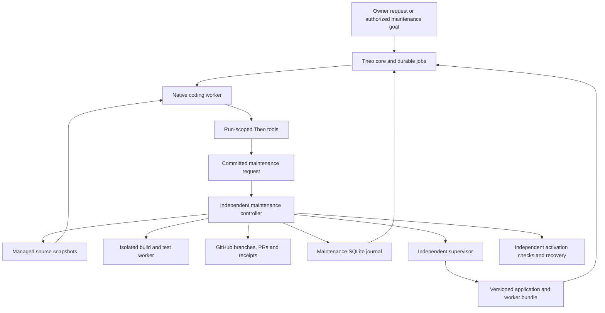

# Theo self-maintenance

Design date: 9 September 2026. **Proposed implementation, not an enabled capability.**

Implementation is in progress. Source now includes separated operating controls,
job-origin inheritance, a scoped runtime-control tool, the controller policy and
journal, source ingestion, the core/controller bridge, GitHub effects, bundle
activation and recovery orchestration. These have offline fixture evidence; the
complete installation, compatibility and real conversational deployment/rollback
acceptance below remain required before claiming completion or enabling proactive
maintenance.

Owner clarification on 10 September: "Luke" refers to Theo. The owner authorizes
access across the host, with confirmation for major destructive and privacy-impacting
actions. `host_command` provides this through a private, exact action approval;
fixed diagnostics use standing permission. Approved general host commands can reach
beyond a source workspace, while ordinary native coding/test workers keep their
boundaries. Privileged access uses a separately pinned launcher. This extends the
original no-general-host-shell proposal below; it does not give candidate code the
ability to authorize its own host operations.

Theo must be able to maintain its own application: inspect its source, implement a
change, test it, push it to GitHub, deploy it, verify the running result, and recover
from a bad release. Ordinary changes inside the owner's standing policy must finish
without asking the owner to operate Git, SSH, the release builder, or launchd.

The owner can request a change conversationally. Theo can also initiate maintenance
from a concrete failure or an authorized improvement goal. Both use the same durable
pipeline. The reasoning worker edits and explains; an independent maintenance
controller performs publication and deployment. That controller stays alive when
Theo's application stops.

## 1. Findings that this design resolves

The [review evidence](evidence/self-maintenance-review-2026-09-09.json) records a
read-only inspection of the running `20260909-ffdb217` release on `fpl0.local` and
matching hashes for ten relevant local modules at `edb2fd2`.

| Finding | Current evidence | Consequence |
| --- | --- | --- |
| Source workspaces are disconnected from jobs. | `application/coordinator.py` creates a directory; `create_worktree` and `promote_worktree` have test callers but no production caller. | A coding tool exists, but Theo does not receive a managed checkout of itself. |
| Publication is absent. | The 52-entry `tools/registry.py` has no publishing operation. Generated commands use `execution/isolation.py` with networking denied and no GitHub credential handoff. | A worker cannot clone or push through `command_run`. |
| Deployment is operator-only. | `cli/commands.py` calls `Releases`; `operations/releases.py` requires the daemon lock. `supervisor.py` restarts the selected release without an update state machine. | Exposing `Releases.switch()` directly as a tool would fail while the daemon is running. Stopping the daemon would also stop that tool's caller. |
| Permission and qualification are conflated. | `/resume background` and the service loop require `deployment_ready`, including the seven-day report. | Natural-language permission cannot resume work; changing the pause flag alone is reversed by the service loop. |
| Requested child work shares the blocked lane. | `delegate` creates a background job; a background pause admits only reminders in that lane. | Explicitly requested maintenance cannot reliably continue as a durable child task. |
| The intended source baseline is behind production. | GitHub's default branch was `main` at `cbda6e2`; the installed application was `ffdb217`. | Starting from the default branch without reconciliation could discard deployed functionality. |

The original implementation commit `7a0a699` already marked G11 self-patch
orchestration and A32 automatic rollback incomplete. This is a missing product
capability, rather than a newly introduced model refusal.

## 2. Product contract and standing permission

Recommended installation policy for this owner:

| Decision | Default |
| --- | --- |
| Repository and deployment target | Only `fpl0/theo` and this Theo installation on `fpl0.local`. |
| Publication | Create `theo/change-<id>` branches and a PR against `main`; merge automatically after the prescribed checks and review. Respect actual repository rules. |
| Activation | Automatically deploy the resulting tested merge commit when the request targets deployment. Publishing alone is also supported. |
| Routine changes | Application code, tests, documentation, tool implementations, and compatible dependencies/migrations can proceed under standing permission. |
| Proactive initiation | A recorded failure or an active owner-authorized improvement goal is required. No continuous speculative rewrite loop. |
| Concurrency | One activation, including its probation period, per installation. Coding can use existing job capacity. |
| Initial proactive limits | At most two candidate revisions per incident and two proactive deployments per day; then preserve the result and report the blocker. Owner-requested work retains normal job budgets. |
| Authority changes | Adding another repository/host, widening credential permissions, changing billing policy, weakening isolation, or performing a destructive data conversion requires a new owner decision. |

PRs provide a durable diff, CI record, and history; a human approval is not an
intrinsic step for routine changes. If repository rules require human approval,
the controller reports that exact blocker and preserves the ready PR. It never
bypasses the rule or mistakes an agent review for an independent human approval.

Standing permission is a versioned installation policy, stored outside the
application's writable paths. It contains repository identity, target identity,
allowed operations, required checks, limits, and emergency rollback authority.
It is not inferred from persona, memory retrieval, repository instructions, or PR
comments. A private owner message becomes an attributed request through the
existing authenticated channel. The host attaches its authority; the model cannot
supply an owner ID or invent a grant.

Checks run again against the current policy immediately before each external or
activation effect. Revocation stops new effects. Previously observed remote effects
remain recorded; revocation does not erase history. A deployment already switched
may still use its preauthorized recovery path to restore service.

## 3. Process and ownership boundaries

**Core:** owns conversations, canonical memory, model eligibility, jobs, and normal
delivery. Thin tool handlers call a maintenance service through injected clients;
they do not import the application or supervisor. Ordinary model turns retain
their existing sandbox and run-scoped broker.

**Coding/build workers:** receive only a specific source workspace, staged
dependencies, and scratch space. Candidate code, packaging hooks, tests, and Git
hooks are all executable input. They never run with deployment credentials or
write access to live state. The builder does not inherit the controller's
environment or run a candidate `scripts/build_release.py` with controller authority.

**Maintenance controller:** runs as a separate launchd service with its own pinned
installation, durable journal, repository cache, and GitHub credential. Use a
dedicated non-admin service identity with ACLs for its own directories and immutable
bundle staging. The application and native runner cannot read its credential or
rewrite its policy, code, journal, or accepted bundles. No general sudo, SSH shell,
launchctl command, arbitrary repository URL, or arbitrary filesystem path is exposed
to the model. Installation must prove these boundaries with real process canaries.

**Supervisor:** retains core process ownership, birth-time checks, maintenance stop,
restart, and independent failure reporting. Add a small authenticated local protocol
for drain/stop/start and bundle selection. Authenticate the controller's OS identity;
validate operation ID, expected active bundle, and target bundle. Do not accept shell
text. Core-side drain acknowledgement uses a separate restricted endpoint. The
controller never needs arbitrary access to the core's SQLite file.

The installed controller/supervisor are the deployment control layer. Theo can
prepare, test, and publish changes to them too. Activate control-layer updates
separately from an application update, with no activation in progress: stage an
inactive control bundle, verify old/new protocol and journal compatibility, let the
existing supervisor hand over, and retain the old bundle until the new controller
reports readiness. Authority
expansion still requires an owner decision. A minimal separately installed launcher
must be able to select the previous controller when the new one cannot start; its
own replacement is an installation operation. A routine application deployment
must never replace the process responsible for recovering that deployment.

## 4. Source preparation, editing, and trusted verification

1. At installation, bind the repository by GitHub repository ID and approved URL;
   reconcile the installed deployment branch into the intended `main` baseline.
   Record the installed source commit and tree. Do not silently reset either side.
2. The controller fetches the bound repository into its own bare cache. A change
   records both the current installed release and the selected source base commit.
   If their histories diverge, prepare an integration change before routine updates.
3. Materialize a source workspace for a durable coding job. It must have its own
   Git metadata, if any; a linked worktree pointing at a protected shared `.git`
   directory is incompatible with the current worker boundary. Files and tools
   remain scoped to the job. Resume the same change workspace across attempts.
4. Theo edits with existing file/command tools. The host supplies an offline test
   environment matching the selected lock, including writable caches and temporary
   directories inside the workspace. Dependency downloads are a separate controller
   capability, not an exception to arbitrary generated-command networking.
5. Submission ends writes for that candidate and copies a bounded source snapshot
   into controller-owned storage. Reject path escapes, special files, external
   symlinks, private runtime files, and unexpected submodules. Do not import a
   worker's `.git/config`, credential helpers, hooks, or local remotes. Build the
   canonical commit from the accepted tree and recorded parent with controlled Git
   configuration and a Theo author identity. Later edits create a new revision.
6. A trusted verification recipe runs against that immutable candidate. Record
   source/tree hash, lock hash, platform, interpreter, recipe version, exact commands,
   exit status, and artifact hashes. Logs remain private; public summaries contain
   only source-related results. Scan the submitted patch and publication payload
   for credential/private-state material before sending them to GitHub.
7. Run an independent read-only review as a durable Theo job using the existing
   native subscription gate. Give it the diff, task criteria, baseline contracts,
   and observed check results. It cannot approve its own changes or modify the
   candidate. Its report is agent review evidence. New revisions invalidate both
   review and check results.

Verification includes current Ruff, Pyright, offline tests, distribution builds,
the installed-wheel check outside the checkout, and affected behavioral regressions.
The controller pins minimum checks outside the candidate tree. A patch that deletes
tests or changes CI cannot redefine its own acceptance criteria. Changes to these
checks must themselves be reviewed against the previous recipe; weakening a required
gate is a policy change.

Dependency preparation accepts the validated lock and approved package sources,
downloads hash-checked artifacts without executing them, then installs/builds them
inside the builder. Source distributions require isolated builds too. Local/VCS
sources, new indexes, runtime assets, and vendor binary updates require explicit
provenance handling; they must not become arbitrary controller-side commands.
The resulting bundle derives its version from the built candidate, not from an
import of the controller's installed Theo package.

## 5. Model-facing tools and conversation behavior

These are proposed strict schemas; fields identifying the owner, repository,
installation, job generation, and authority are host-owned.

| Tool | Model arguments | Effect and result |
| --- | --- | --- |
| `maintenance_begin` | `objective`, `target: publish or deploy`, evidence references | Write: commit a request and durable coding job. Return `change_id`, `job_id`, and `preparing`; workspace admission waits for controller acknowledgement. |
| `maintenance_submit` | `change_id`, `expected_revision`, `summary` | Write: freeze the calling coding job's host-issued workspace revision and request the pipeline through its authorized target. Return candidate ID and queued verification status. |
| `maintenance_status` | Optional `change_id` | Read: actual stage, installed/candidate commit, check results, PR URL, receipt state, and typed blocker with the next possible action. |
| `maintenance_cancel` | `change_id` | Write: persist cancellation. Before activation, stop at a safe boundary; after switching, perform the authorized recovery or retain a verified release as described below. |
| `maintenance_rollback` | `deployment_id`, `reason` | Write: request the recorded compatible previous bundle, with the same controller checks and durable outcome. No arbitrary path or database restore. |
| `runtime_control` | `scope`, `paused`, `reason` | Write: change only an allowed operational control under a host-attached owner grant. It cannot change policy, qualification evidence, or subscription eligibility. |

Private owner conversations can request maintenance. Groups/topics cannot alter the
assistant globally or obtain its private source/status. Critic jobs receive read
tools only. Existing `BoundDatabase` fencing applies when committing tool intent.

A maintenance request is a durable task, not a subprocess attached to the originating
conversation turn. Its accepted authority survives normal completion/expiry of that
turn. Cancellation of the actual maintenance job is explicit and propagated. A stale
worker cannot submit a new candidate or change another job's workspace.

The host issues a new workspace revision when dispatching an authorized repair
attempt after failed checks. Submitting the same revision replays its existing
receipt; a later revision gets a new semantic identity even if the summary is the
same. The model cannot overwrite an accepted candidate by retrying a tool call.
Maintain separate bounded deadlines for model attempts and the overall maintenance
operation so CI and probation do not depend on an expired conversation lease.

Example intended experience:

> Owner: Fix the reply formatting, push it, and deploy it.
>
> Theo: I’ve started the change. I’ll test it, push the PR, and deploy it once the
> checks pass.
>
> Theo, after observed completion: Deployed `abc1234`. The checks passed, the bot is
> healthy, and the change is on GitHub: [PR link].

If activation fails, the final report names the failed stage and observed rollback
result. If only publication succeeded, it says published and gives the active old
release. `committed` means the request is durable; only a controller activation
receipt establishes deployed. The completion notification uses the normal delivery
ledger and can be pending independently of successful deployment.

## 6. Durable state and cross-process handoff

Keep canonical conversational state and coding jobs in Theo's existing SQLite
database. Give the controller its own **canonical maintenance journal** so it can
recover while the application and its database schema are unavailable. The databases
own different records; a status copied into Theo is a revisioned projection, not a
second authority for whether deployment happened.

Core migration, using the next unused migration number at implementation time:

- `maintenance_intents`: request ID, originating owner/conversation/job, authority
  reference, target, request hash, change ID, delivery state, cancellation intent.
- `maintenance_events`: controller event ID/revision and delivery/report linkage;
  unique event IDs prevent duplicate final messages after reconnection.

Controller journal:

| Record | Essential fields/invariant |
| --- | --- |
| `changes` | ID, request key/hash, repo/installation IDs, source job, policy revision, objective, target, stage, status, revision, deadline; unique request key. |
| `candidates` | Change ID, revision, base/head/tree SHA, immutable snapshot path/hash, lock hash; never overwritten. |
| `checks` | Candidate/bundle hash, check identity, trusted recipe hash, environment fingerprint, outcome, timestamps, private log reference. |
| `external_effects` and receipts | Operation, repository/ref/PR target, exact content hash, expected remote state, dispatch status, observed remote receipt. |
| `deployments` | Candidate/merge SHA, manifest hash, previous/target bundle, schema compatibility evidence, drain epoch, activation generation, stage, health evidence, terminal result. |
| `events` | Monotonic revision, change/deployment ID, typed event, time; replayable projections to core. |

Reuse the delivery action/receipt semantics for GitHub effects. Extract only the
storage-independent effect primitives needed to support a controller-owned ledger
and typed non-conversation destinations; do not implement a second ad hoc retry
policy. A publishing action's destination is the GitHub repository/ref, while its
reporting conversation stays private. Preserve all existing Telegram behavior.

The core commits intent and the associated job in one SQL-only transaction. A
bridge sends the intent to the controller outside that transaction. The controller
accepts each request key once and rejects a reused key with different content.
If the acknowledgement is lost, the bridge queries that same key before proceeding.
The reverse event bridge records controller revision and prepares the corresponding
message/action atomically. This is an at-least-once protocol with idempotent acceptance,
not a distributed transaction.

Controller transactions use the same SQLite discipline: async database API,
synchronous SQL-only write callbacks, WAL, FULL synchronization, short writes,
compare-and-swap revisions, and separate bounded reads. Persist stage intent before
an effect and observed outcome afterwards. Only one controller process holds the
installation lock; every effect rechecks its activation generation and policy.
After a crash, identify surviving child processes by PID **and birth time** and
reconcile them before granting a new generation. A lock does not stop orphaned
processes by itself.

Stages are `preparing -> editing -> verifying -> publishing -> awaiting_ci ->
merging -> packaging -> staged -> draining -> activating -> checking -> observing`.
Terminal results distinguish `published`, `deployed`, `rolled_back`, `failed`, and
`cancelled`. `blocked`, `auth_wait`, `quota_wait`, and `uncertain` retain their
current stage and a typed reason. They are not success states. Publishing-only
requests stop at a verified branch/PR receipt without merging or activating.

## 7. GitHub publication and merge semantics

Use a GitHub App installed only on `fpl0/theo`. Its private credential stays in the
controller credential store. Mint repository-scoped installation tokens on demand;
tokens are short-lived and never exposed to model tools, candidate processes, Git
remote URLs, command arguments, logs, or source snapshots. GitHub documents
[installation authentication](https://docs.github.com/en/apps/creating-github-apps/authenticating-with-a-github-app/authenticating-as-a-github-app-installation).

Grant contents and pull-request writes, with only the read permissions needed for
checks/status/Actions metadata. Do not grant repository administration or bypass
permissions. Workflow-file publication requires the corresponding explicitly
provisioned permission; otherwise return a concrete authorization blocker.
Use controller-owned Git configuration and an ephemeral credential mechanism for
transport, isolated from the candidate process.

Publish a deterministic branch with an expected old ref. Do not force-push over
another actor's work. Create/update the PR using its recorded change ID and branch;
never publish private conversation excerpts or raw execution logs as the body.
Record branch SHA, PR number/URL, check-run IDs, and the final merged SHA.

Before merge, require the prescribed checks on the exact PR revision and actual
integration tree. A changed base/head invalidates affected results and requires
integration/review again. Pass the expected head SHA to the
[merge API](https://docs.github.com/en/rest/pulls/pulls#merge-a-pull-request).
Repository strict checks or its merge queue must protect against a concurrent base
change; the head parameter alone does not freeze `main`.

Regardless of merge method, fetch the **resulting merge commit**, revalidate its
tree against the reviewed integration result, and run the required merged-commit
checks before packaging. Never deploy a branch name resolved later, an earlier
pre-merge build, or an artifact merely because a PR is marked merged.

Inspect actual named check conclusions and expected workflow/recipe identity.
`skipped`, `neutral`, missing, stale, and cancelled do not satisfy Theo's deployment
gate. GitHub's own mergeability rules can accept some of those conclusions, so
[GitHub mergeability alone](https://docs.github.com/en/pull-requests/how-tos/merge-and-close-pull-requests/troubleshooting-required-status-checks)
is insufficient. The existing public-repository-only CI policy remains in force;
a visibility change must not silently start paid checks or count skipped CI as pass.

An ambiguous push, PR creation, or merge is reconciled with observed remote state
for that exact effect. A matching remote ref/PR/merge receipt can establish success.
A network timeout or missing local response cannot establish failure. If neither
success nor confirmed no-effect can be established, retain `uncertain` and stop
dependent stages. Do not create another PR or blindly replay a merge.

## 8. Deployment, canaries, and rollback

Build before disturbing the running service. A release bundle contains the installed
core, matching worker shim and dependencies, selected native runtime plus required
helpers, lock, source/merge SHA, trusted check receipts, manifest hashes, and
read/write schema compatibility. The independent controller and supervisor are
versioned separately with explicit protocol compatibility.

Accept an immutable bundle into controller/supervisor-owned storage. Verify all
required files and entry points, reject traversal/external links/unlisted executable
content, and bind acceptance to the full manifest hash. A candidate-supplied
`canary_passed: true` is not an attestation. Only the trusted verifier can record
acceptance. The supervisor selects core and worker from the same bundle descriptor;
do not switch them using unrelated pointers or mutable per-release configuration.

Store bundles outside the protected core data tree so the sandboxed worker can read
its pinned interpreter while live state remains inaccessible. Preserve exactly one
canonical atomic selection: `releases/current` points to an immutable bundle whose
`bundle.json` is its descriptor. Do not maintain a second independently mutable
worker or activation pointer. Keep `bin/python` as the selected core's compatibility
entry point for existing operator commands.

The descriptor binds `bundle_id`, `source_sha`, `manifest_hash`, core interpreter,
worker interpreter, native executable/helper hashes, and protocol/schema ranges.
At startup the supervisor passes the resolved descriptor identity to the core;
the core derives worker paths from it before creating backend/account fingerprints.
A legacy `worker_python` setting must not override a selected bundle.
Native login state stays in the existing protected runner home, outside code bundles.
The supervisor performs independent process and read-only database probes through
its narrowly scoped host services; candidate code cannot self-attest these checks.

Activation procedure:

1. Recheck policy, merged-commit evidence, local capacity, target identity, native
   eligibility needed for the canary, and compatibility with the previous bundle.
   Capture the active bundle and operational-control revision.
2. Request a drain epoch. Stop admitting model jobs and stop claiming new outbound
   sends after current sends finish; preserve newly received inbox items and queued
   reminders. Require no running workers, active tool calls, or executing deliveries.
   Finish the originating acknowledgement before shutdown. Default drain deadline:
   two minutes; if it expires, abort activation and keep serving the old release.
3. Ask the supervisor to stop the core and verify process exit and daemon-lock
   acquisition. Take the required local pre-switch snapshot under the owner's
   existing release-snapshot policy. This does not enable routine backups or make
   a machine-loss recovery claim.
4. Persist `activating` with expected old/new bundle IDs. Atomically replace the
   `releases/current` pointer after fsync of accepted bundle files, fsync its parent
   directory, and start the new core. Only one Telegram poller may exist for this bot.
5. Bound initial health verification to two minutes: expected source/bundle hash,
   actual running PID/birth time, heartbeat, database integrity and schema, broker
   connection, Telegram polling, and a native tool canary on the configured included
   subscription. The canary must exercise an actual Theo tool and its recorded
   result; a greeting or tool listing is insufficient. Use a synthetic qualification
   conversation with local delivery, excluded from personal memory and proactive
   activity. Normal owner notification separately verifies Telegram delivery.
6. Restore admission using compare-and-swap on the maintenance-owned control
   revision. Preserve any owner pause made during deployment. Never unconditionally
   set background/models/notifications to enabled, and never lose an earlier enabled
   state by setting an unrelated blanket pause.
7. Observe a ten-minute probation period before marking the operation `deployed`
   and admitting the next activation. Startup failures, repeated new crashes,
   corruption, or a broken broker/tool canary trigger recovery. Ordinary unrelated
   job failures, expired subscription allowance, and external network outages must
   not be mislabeled as application regressions. Report `running; verification
   pending` when that is the actual state.

The same controller performs rollback without requiring inference. Stop/drain as
appropriate, verify the recorded previous bundle can read and write the current
schema, switch the whole application/worker descriptor, restart, and verify it.
Mark the failed candidate quarantined and do not retry it automatically. Preserve
database contents, jobs, receipts, cancellation, and uncertain effects. Code rollback
does not retract messages, undo a GitHub merge, or restore an old database.

If rollback also fails, open the deployment circuit, keep the journal and both
bundles, and emit one independent health alert with a recorded outcome. Existing
supervisor restart limits still apply; do not create an endless deploy/revert loop.

Cancellation before switching abandons activation and releases the drain. During
switching/checking, finish recovery to the known compatible bundle before declaring
cancelled. During probation, an explicit deployment cancellation requests rollback;
a pause of future deployments alone does not undo the active release. Completed
deployments use the explicit rollback operation.

## 9. Schema evolution and compatibility

Automatic rollback is allowed only when the previous application has been tested
against the post-migration schema. Manifest integers alone cannot prove this.
Before activation, upgrade a disposable snapshot with the new wheel, then exercise
the old installed application against it. Verify old reads **and writes**, jobs,
delivery receipts, and immutable migration checksums. Preserve failed fixtures.

Use expand/contract migrations: add compatible structures, deploy code that can
handle both forms, and retire old structures only when the retained recovery
release no longer needs them. Destructive or non-reversible conversions are a
separate owner-reviewed maintenance plan with explicit downtime/recovery semantics.
Theo may prepare and publish them; it cannot treat an automatic database restore
as code rollback.

Evolve the controller journal separately. A controller update must preserve the
old controller's ability to resume pending operations during handover. An app
migration must never make the controller unable to recover that app.

## 10. Operational controls and qualification

Replace the overloaded background control with explicit policy and controls:

| Control | Meaning |
| --- | --- |
| `models_paused` | No new inference anywhere, including maintenance coding/review. Deterministic rollback remains available. |
| `autonomy_paused` | No new unsolicited goals, outreach, or self-initiated maintenance. |
| `requested_work_paused` | Pause queued owner-requested non-interactive work. Interactive control commands still work. |
| `deployments_paused` | No new activation; source editing/testing/publication can continue if otherwise authorized. |
| `notifications_paused` | Preserve normal delivery pause semantics; record deployment success separately from notification delivery. |
| Supervisor service pause | Stops the application itself. It does not stop the independent recovery controller. |

Worker lane is a capacity decision. Work origin and authorization are separate
host-created fields inherited by child jobs. An owner-requested maintenance child
therefore does not become unsolicited autonomy merely because it runs in a background
slot. Reuse the real model/account/isolation guards for every inference attempt.

Add model-accessible, private-owner runtime controls through the broker and route
slash commands through the same service. A model cannot unpause itself while models
are paused; the deterministic owner command path remains available. A request to
deploy does not automatically grant permission to resume unrelated background work.

Migrate existing `background_paused=true` conservatively to both autonomy and
requested-work pauses. Keep `/pause background` as an explicit alias for both;
provide narrower controls and clear status. Migration alone does not resume
anything. At installation enablement, apply the owner's chosen operating policy
once and record it. Temporary deployment draining is distinct from all owner pauses.

Separate **permission**, **release readiness**, and **reliability evidence**:

- Permission answers whether this change and effect are within the standing mandate.
- Release readiness checks the exact candidate's tests, local boundary, compatibility,
  current required native eligibility, and recovery path.
- Reliability evidence reports accumulated native/behavior/capacity/soak results
  with their real source, platform, and time scope. Seven-day qualification remains
  false until observed; a repair does not fabricate it or restart an arbitrary
  seven-day waiting period for every patch.

The owner-authorized operating mode may run requested tasks and bounded autonomy
before full production qualification. This is an explicit new policy contract,
not writing `production_qualified=true` or silently removing an account gate.
Update both `/resume` and the daemon's periodic admission check together so they
use the same decision service and report specific blockers.

## 11. Failure and recovery rules

| Interruption | Required behavior |
| --- | --- |
| Core dies after committing request but before acknowledgement | Bridge resends the same request key; one controller change and one coding job result. |
| Coding worker dies or loses quota | Preserve source revision and job evidence; wait for the existing explicit recovery/retry policy. Never switch to metered inference. |
| Candidate changes after checks | New immutable candidate ID; prior checks and review cannot authorize it. |
| Another PR advances `main` | Recompute integration, rerun invalidated checks, then verify the actual merged commit. |
| Push/PR/merge response is lost | Query the exact remote effect; retain uncertainty when evidence is insufficient. |
| Controller dies while a child process survives | Reconcile process identity and operation stage before resuming; do not overlap publishers or activators. |
| Crash after pointer replacement but before journal receipt | Inspect the descriptor, running process, manifest and persisted activation intent; continue verification or rollback the recorded pair. |
| New release starts but fails native-tool verification | Recover the compatible prior bundle and report both failure and recovery evidence. |
| User pauses or revokes authority during the operation | Recheck policy before the next effect; preserve the newer pause while completing necessary recovery. |
| Deployment succeeds but final Telegram send is uncertain | Deployment remains successful; its notification is uncertain and is not blindly resent. |
| Merged change fails deployment | Keep GitHub history intact, quarantine the release, and prepare a normal revert/fix PR under policy. No force-push or database restore. |
| Disk full, corruption, or no compatible recovery bundle | Fail preflight or stop at the last recoverable stage; preserve evidence and raise an independent actionable alert. |

## 12. Implementation sequence and completion criteria

1. **Authority, schema, and controls:** introduce request origin, versioned standing
   maintenance policy, separated pause controls, the core/controller handoff schema,
   and typed status. Add migration and private/group authorization regressions.
2. **Controller and source work:** install the isolated controller service and its
   journal; reconcile the existing deployment baseline; wire real source preparation,
   durable coding jobs, immutable submission, dependency staging, tests, and review.
3. **GitHub effects:** implement the repository-bound publisher and receipt
   reconciliation; connect the GitHub App; enforce revision-specific checks and
   merge handling. Prove a real branch/PR/merge flow on an explicitly configured
   test repository before using the production repository.
4. **Deployment and recovery:** add supervisor protocol, bundle descriptors,
   drain acknowledgement, core/worker compatibility, migration canaries, independent
   health checks, and rollback recovery from every activation stage.
5. **Complete conversational path:** exercise one owner request through edit,
   test, publication, activation, actual native-tool execution, and final receipt;
   then inject a bad candidate and verify independent rollback. Only after this
   end-to-end proof enable proactive maintenance under the owner's policy.

Suggested source ownership: `work/maintenance.py` for core intent and job orchestration;
`tools/handlers/maintenance.py` for adapters; `operations/controls.py` for common
operating decisions; a separately packaged `maintenance/` service for controller
state, source preparation, verification, GitHub effects and deployment coordination.
Keep the supervisor protocol small and independent. Lower layers must not import
application, channels, or tool handlers; inject bridge and supervision clients.

Required acceptance cases:

- A real model sees Theo's source, changes a fixture behavior, and submits a candidate
  through the broker; its immutable artifact contains that exact change.
- Run-bound revocation, stale generation, group scope, and forged authority fail
  before submission, publication, or control mutation.
- Candidate tests/build hooks cannot access core state, GitHub credentials, controller
  policy, sibling workspaces, or protected bundle paths, including after reboot.
- Failed/deleted/skipped checks, changed heads, changed locks, unreviewed integration
  trees, and modified manifests cannot activate a release.
- Lost acknowledgements and process kills at each handoff produce one accepted
  change, observable remote receipts, and no overlapping activation.
- Kill the core and controller separately before/after pointer replacement; recover
  the intended bundle and job/delivery state without duplicate outbound effects.
- The installed bundle's source SHA and worker/native-helper hashes match accepted
  evidence. A real tool call succeeds after deployment, then rollback restores the
  previous compatible behavior when a controlled regression is introduced.
- Additive migration passes old/new application read/write canaries; an incompatible
  rollback is rejected without changing the database to an old snapshot.
- Owner-requested child work can run while unsolicited autonomy is paused; model,
  requested-work, deployment, and notification pauses each keep their meaning.
- Completion reports distinguish publication, merge, activation, verification,
  rollback, and notification uncertainty using actual receipts.
- Preserve included-subscription policy, credential boundaries, private conversation
  isolation, and the existing whole-stack observability budget. Bound controller
  logs, workspaces, dependency caches, pending changes, and retained bundles; never
  delete active, previous, in-flight, or explicitly retained recovery evidence.

The focused review checks passed **11 tests** against the existing primitives.
They establish neither this proposed pipeline nor a live self-deployment. Full CI,
installed-package checks, fault-injection tests, and the real conversational
deployment/rollback proof above are required to call this feature implemented.
